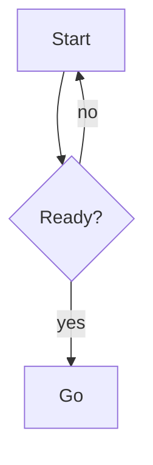
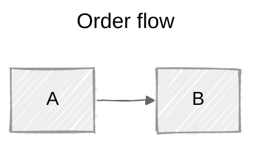
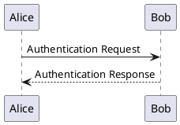

# Diagrams in slides

## Mermaid

A code block tagged `mermaid` renders as a diagram. Pass options as a **JavaScript object
literal** after the language — quote strings, separate with commas:

````md

````

`scale` is the lever that matters on slides: diagrams render at their natural size and
overflow silently. Start around `0.7`–`0.9` for anything past a handful of nodes.
`theme` accepts `default`, `neutral`, `dark`, `forest`, `base`.

Diagram-wide settings also go in a YAML front block **inside** the diagram:

````md

````

### Picking a diagram type

| You want to show | Use | Reference |
|---|---|---|
| steps, decisions, a process | `flowchart` | `references/mermaid-flowchart.md` |
| who calls what, in what order | `sequenceDiagram` | `references/mermaid-sequence.md` |
| types, fields, inheritance | `classDiagram` | `references/mermaid-structure.md` |
| modes and transitions | `stateDiagram-v2` | `references/mermaid-structure.md` |
| tables and their relations | `erDiagram` | `references/mermaid-structure.md` |
| schedule over time | `gantt` | `references/mermaid-data-time.md` |
| events in order, no duration | `timeline` | `references/mermaid-data-time.md` |
| branches and merges | `gitGraph` | `references/mermaid-data-time.md` |
| proportions | `pie` | `references/mermaid-data-time.md` |
| a bar/line chart | `xychart` | `references/mermaid-data-time.md` |
| 2×2 positioning | `quadrantChart` | `references/mermaid-data-time.md` |
| an idea tree | `mindmap` | `references/mermaid-structure.md` |
| memory/packet byte layout | `packet` | `references/mermaid-structure.md` |
| services and their links | `architecture-beta` | `references/mermaid-structure.md` |
| flow volumes between stages | `sankey` | `references/mermaid-data-time.md` |
| a user's steps and feelings | `journey` | `references/mermaid-data-time.md` |

The most common one by far is `flowchart`; read that reference first.

**Version note:** newer diagram types dropped their `-beta` suffix as they stabilized. If
`packet`, `block`, `sankey`, or `xychart` fail to parse, the installed Mermaid is older —
append `-beta` to the keyword. `architecture-beta` still carries the suffix.

### Two syntax traps

- A node id of exactly `end` in lowercase **breaks the flowchart**. Write `End` or `END`.
- A node id starting with `o` or `x` right after a link turns the link into a circle or
  cross edge: `A---oB` is a circle edge, not a node called `oB`. Add a space (`A--- oB`) or
  capitalize.

### Slide-sized diagrams

Keep a slide diagram to roughly 5–9 nodes. Past that, either split it across slides or pair
it with click animations — wrap the block in `<v-click>`, or put successive versions of the
diagram on consecutive slides so it appears to grow.

Mermaid renders as inline SVG, so it inherits the slide's font and scales with the canvas,
and text inside stays selectable and searchable.

## PlantUML

A `plantuml` code block is rendered by a server (`plantUmlServer` in the headmatter,
default `https://www.plantuml.com/plantuml`). It accepts the same options object:

````md

````

Note that this sends your diagram source to a remote server on every render, and it needs
network access at build time. Mermaid is local — prefer it unless you need a PlantUML-only
diagram type.

## LaTeX / KaTeX

Math is not a diagram, but it lives in the same part of a deck.

- Inline: `$\sqrt{3x-1}+(1+x)^2$`
- Block: `$$ … $$` — bigger symbols, centered

Block math supports the same click-step line highlighting as code:

```latex
$$ {1|3|all}
\begin{aligned}
\nabla \cdot \vec{E} &= \frac{\rho}{\varepsilon_0} \\
\nabla \cdot \vec{B} &= 0 \\
\nabla \times \vec{E} &= -\frac{\partial\vec{B}}{\partial t}
\end{aligned}
$$
```

For chemical equations, load mhchem in `vite.config.ts`:

```ts
import 'katex/contrib/mhchem'
export default {}
```

then `$$\ce{B(OH)3 + H2O <--> B(OH)4^- + H+}$$` renders.

## References

- `references/mermaid-flowchart.md` — nodes, shapes, edges, subgraphs, styling
- `references/mermaid-sequence.md` — participants, messages, activation, loops, notes
- `references/mermaid-structure.md` — class, state, ER, mindmap, packet, architecture
- `references/mermaid-data-time.md` — gantt, timeline, gitGraph, pie, xychart, quadrant, sankey, journey

## Related skills

`slide-components` for annotating a diagram with `v-mark`, arrows, and boxes; `slide-theming` for Mermaid defaults via `setup/mermaid.ts`.
