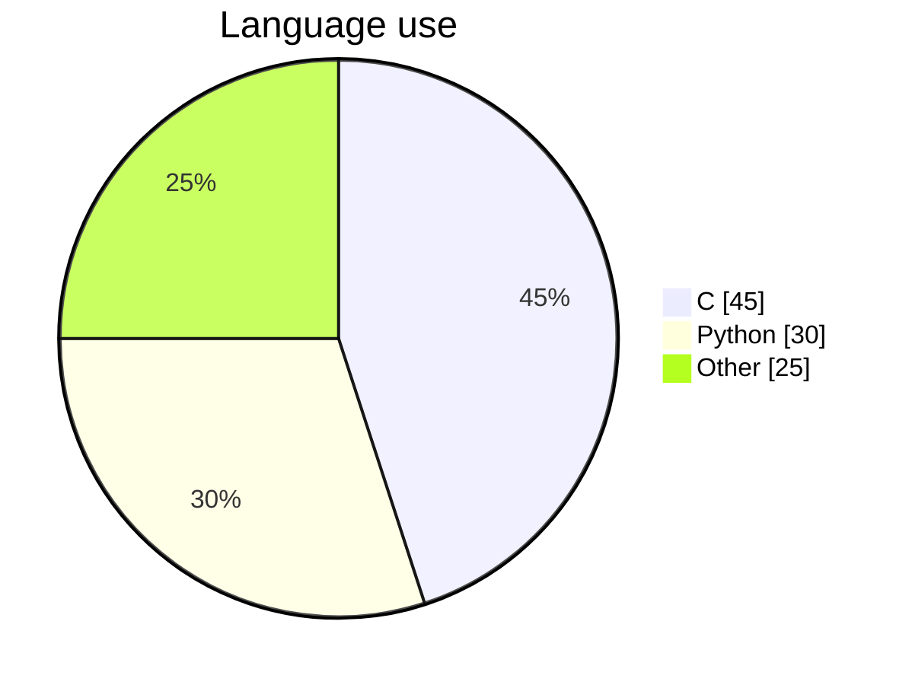
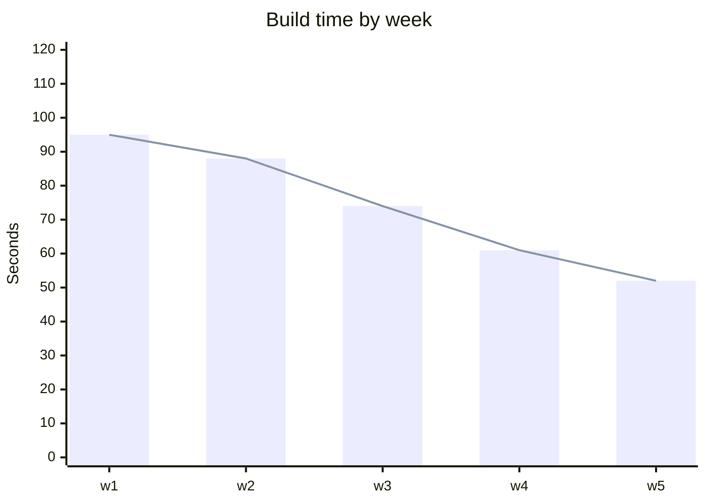
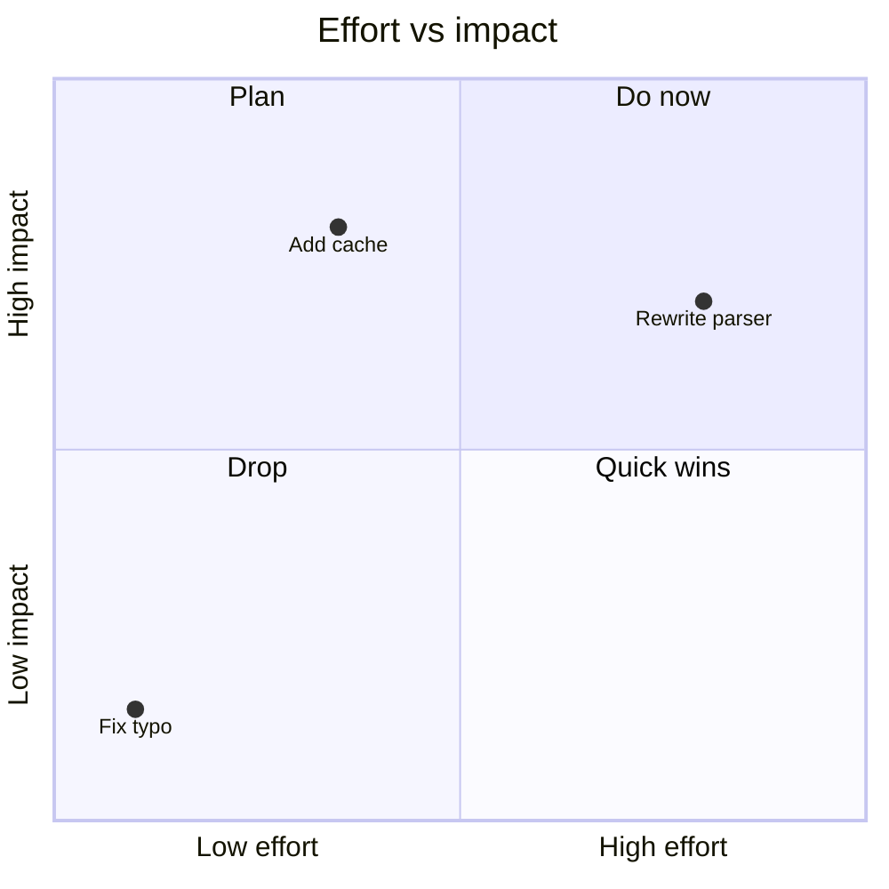
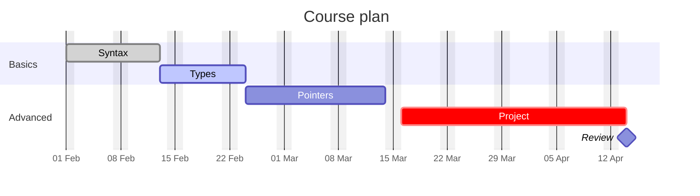
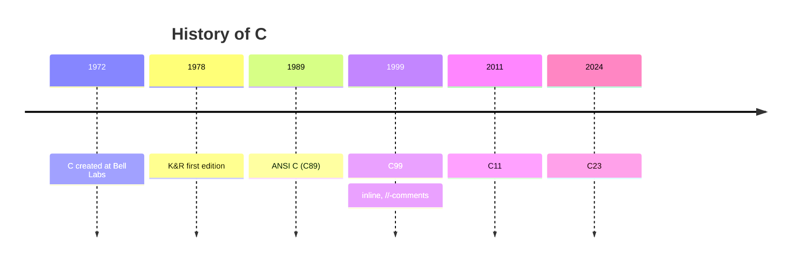
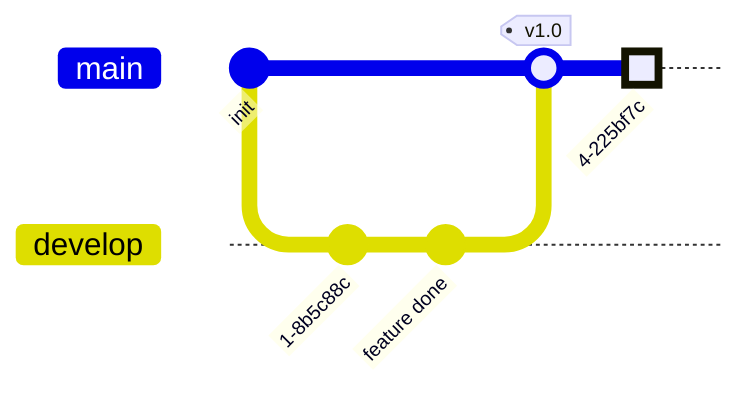
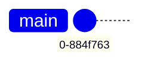
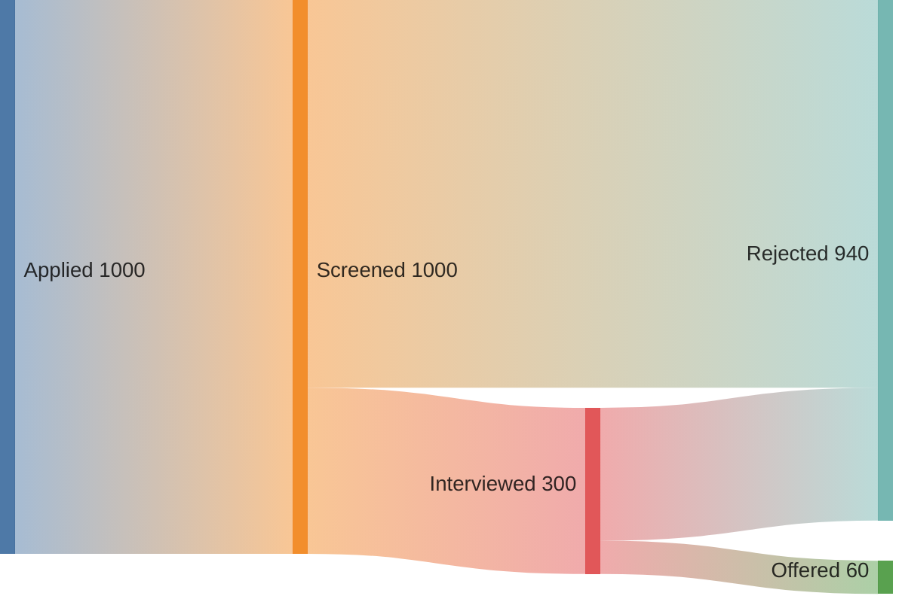
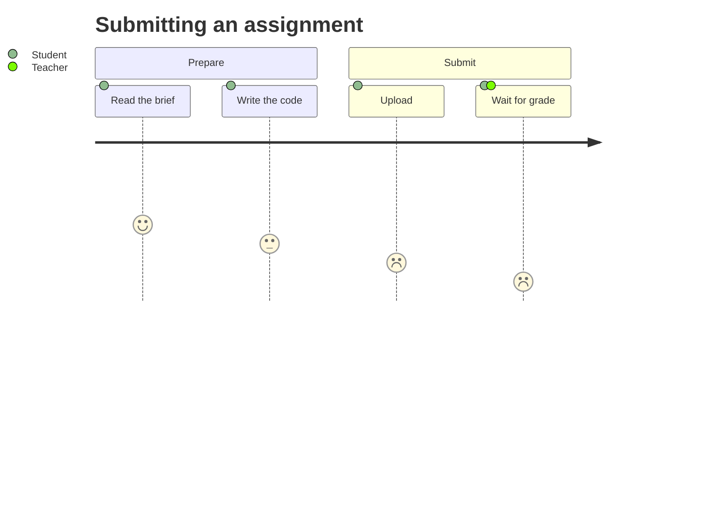
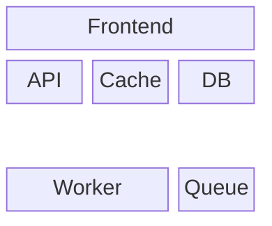

# Mermaid data and time diagrams

Charts, schedules, and anything laid out along an axis.

## Pie



`showData` prints the raw values next to the percentages. Values are summed and converted
to percentages automatically — they need not add to 100.

## XY chart

Bars and lines on real axes.



`xychart horizontal` rotates it. Multiple `bar` / `line` rows overlay series. The
x-axis can be a numeric range instead of categories: `x-axis "Time" 0 --> 100`.

## Quadrant chart

Positioning on two axes — effort/impact, reach/cost.



Coordinates are `[x, y]` in 0–1. Quadrants number counter-clockwise from top-right.

## Gantt



- `dateFormat` parses your input dates; `axisFormat` is the d3 format for the printed axis
- Task tags: `done`, `active`, `crit`, `milestone`
- Duration units: `d`, `w`, `h`, `m`; `after <id>` chains tasks
- `excludes weekends` / specific dates removes them from the timeline

Gantt charts get wide fast. On a slide, keep it to two sections and under ~8 tasks.

## Timeline

Events in order, with no notion of duration — much cleaner than a gantt when you only need
"this, then that".



Multiple `:` entries under one period stack as separate events. `section Name` groups
consecutive periods under a colored band.

## Git graph



Commit options: `id:`, `tag:`, `type:` (`NORMAL`, `REVERSE`, `HIGHLIGHT`).
Also `cherry-pick id: "..."`. Orientation via config:

````md

````

## Sankey

Flow volumes between stages. Input is plain CSV: source, target, value.



No title line, no quotes unless a label contains a comma.

## User journey



Each step is `Label: score: actors`, where score runs 1 (miserable) to 5 (delighted).
Multiple actors are comma-separated.

## Block diagram

Free-form boxes in a grid — handy for architecture sketches without the strictness of
`architecture-beta`.



`columns N` sets the grid width; `name:N` makes a block span N columns; `space` leaves a
gap. Arrows connect declared block ids: `API --> DB`.

## Sizing on slides

Chart types with an axis (`gantt`, `xychart`, `timeline`, `sankey`) render much wider than
tall and will overflow a 16:9 slide before they look crowded. Set `{scale: 0.7}` and check
the rendered slide rather than trusting the source's apparent size.
