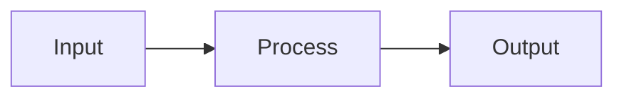
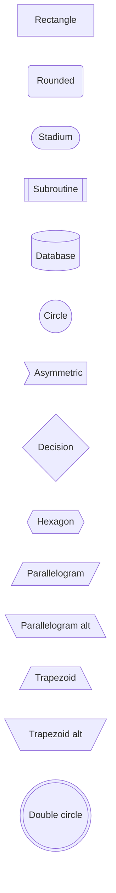
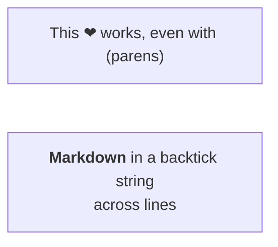
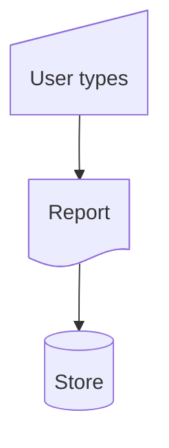
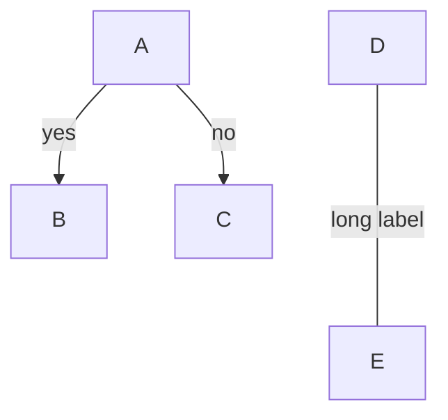
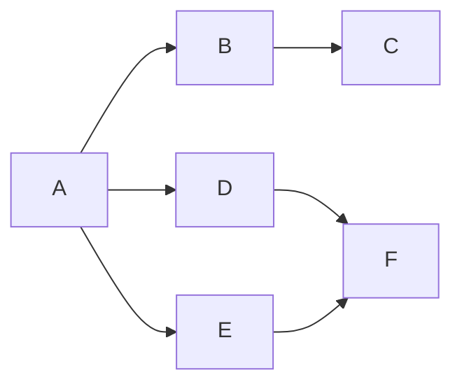
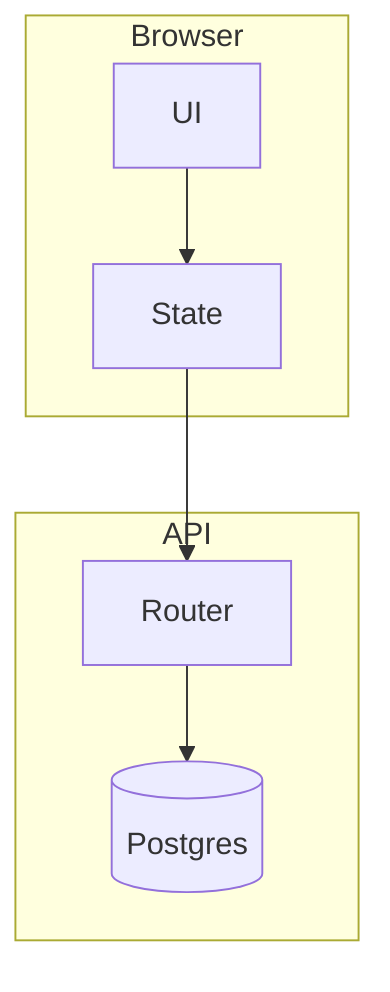
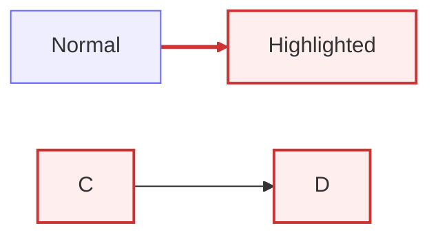
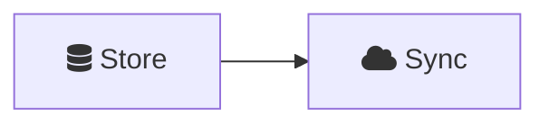
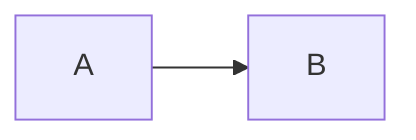

# Mermaid flowcharts

The workhorse diagram. `flowchart` and `graph` are interchangeable; `flowchart` is current.

## Direction

`flowchart TD` (top-down, same as `TB`), `BT`, `LR` (left-right), `RL`.

On a 16:9 slide, `LR` usually fits better than `TD` — a tall diagram gets scaled down until
the labels are unreadable.



## Nodes and shapes

The id is what displays unless you give it text.



Quote the label when it contains punctuation, unicode, or reserved characters:



The general shape syntax (Mermaid 11+) names a shape explicitly, which is more readable
than remembering bracket combinations:



Common shape names: `rect`, `rounded`, `stadium`, `subproc`, `cyl`, `circle`, `diam`,
`hex`, `lean-r`, `lean-l`, `trap-b`, `trap-t`, `dbl-circ`, `doc`, `docs`, `delay`,
`manual-input`, `manual-file`, `fork`, `collate`, `comment`, `bolt`, `das`, `sm-circ`,
`fr-circ`, `text`, `card`, `lin-proc`.

## Edges

```mermaid
flowchart LR
  A --> B      %% arrow
  C --- D      %% open link
  E -.-> F     %% dotted
  G ==> H      %% thick
  I --o J      %% circle end
  K --x L      %% cross end
  M <--> N     %% two-way
```

Length is controlled by the number of dashes — `--->` is longer than `-->`, which is how
you push a node further down a rank.

Labels, two ways:



Chains and fan-out:



`a --> b & c --> d` means both `b` and `c` sit between `a` and `d`.

## Subgraphs



`direction` inside a subgraph sets its internal flow. Links may target the subgraph id
itself, not just nodes inside it.

## Styling



- `classDef name …` defines a class, `:::name` or `class a,b name` applies it
- `style id …` styles one node inline
- `linkStyle N …` styles the Nth edge, counted from 0 in declaration order

On slides, prefer one accent class over per-node `style` — it keeps the diagram readable
and matches the deck's color scheme.

## Icons and images

With an icon pack registered, `fa:fa-truck` inside a label renders an icon:



## Interaction



`click … callback` calls a JS function you registered — rarely worth it in a deck; `href`
is the useful one.

## Two things that break flowcharts

- A lowercase node id `end` breaks parsing. Use `End` or `END`.
- `A---oB` and `A---xB` parse as circle and cross edges, not as nodes named `oB`/`xB`.
  Write `A--- oB` or capitalize the node id.
