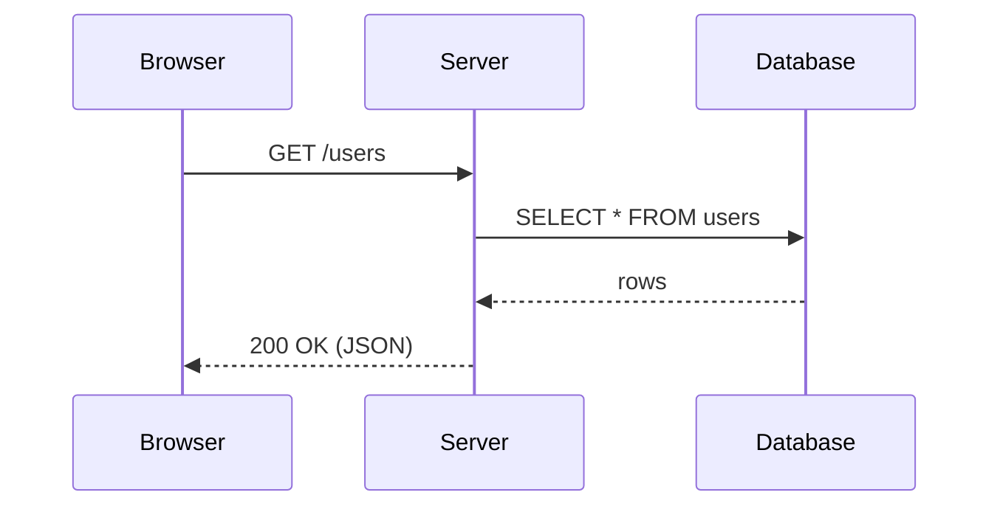
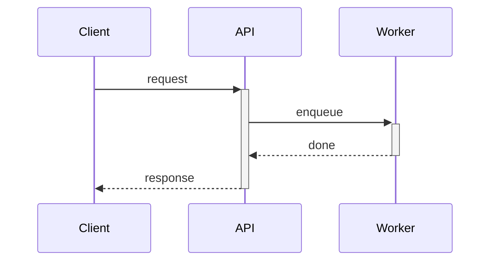
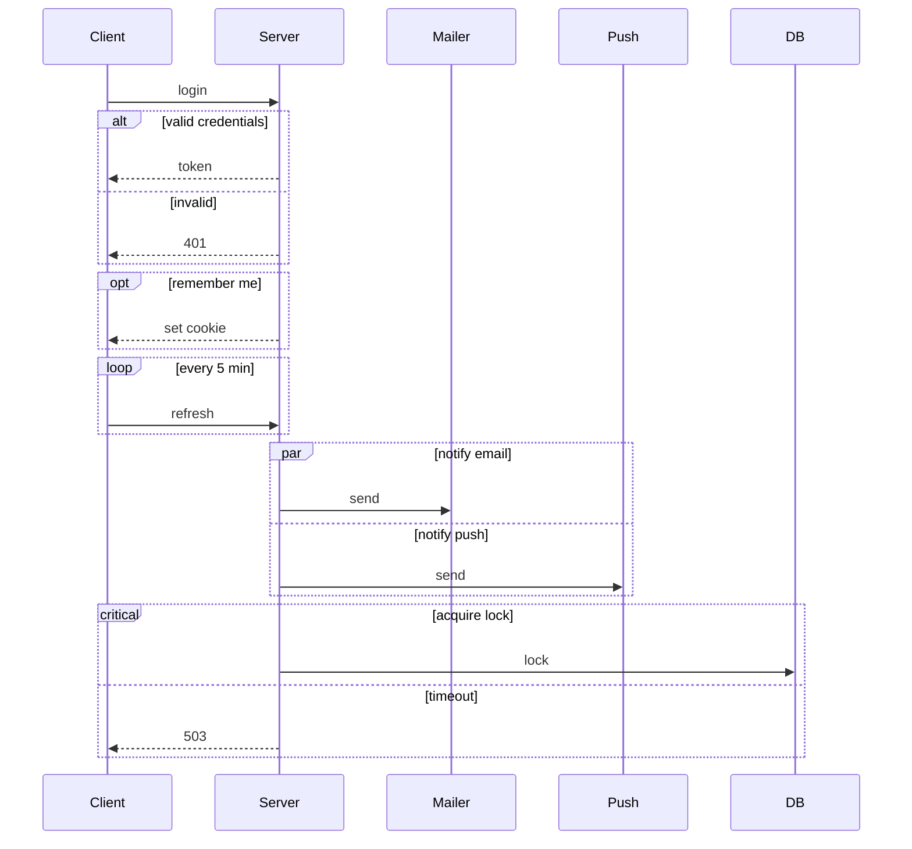
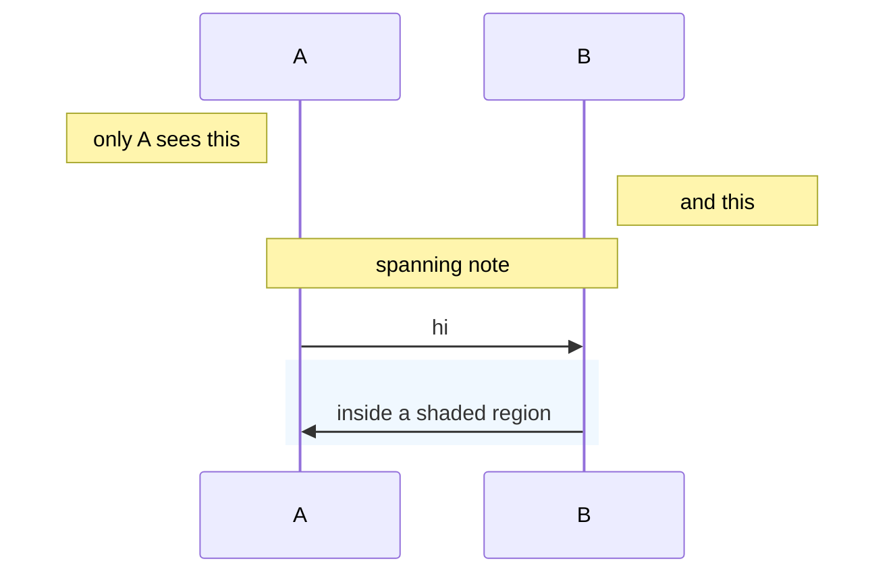
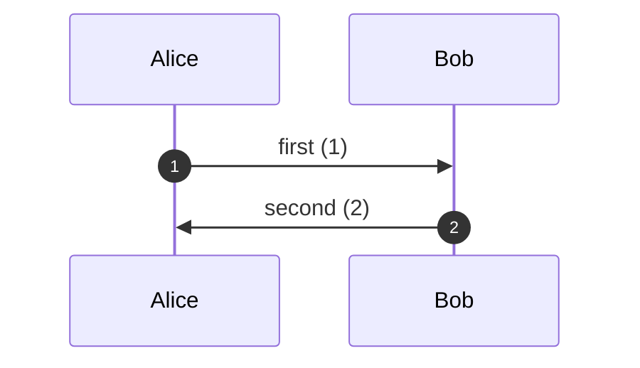

# Mermaid sequence diagrams

Shows messages between participants over time. Good for protocols, request flows, and
anything where *order* is the point.

## Basics

`participant X as Label` sets the display name; declaration order fixes the column order.
Use `actor X` instead of `participant X` to draw a stick figure.

## Arrow types

| Syntax | Meaning |
|---|---|
| `->` | solid line, no arrowhead |
| `-->` | dotted line, no arrowhead |
| `->>` | solid line with arrowhead — a call |
| `-->>` | dotted line with arrowhead — a return |
| `-x` | solid, cross end — async, no reply expected |
| `--x` | dotted, cross end |
| `-)` | solid, open arrow — async |
| `--)` | dotted, open arrow |

The convention worth keeping: solid `->>` going out, dotted `-->>` coming back.

## Activation

`+` and `-` suffixed on the arrow open and close an activation bar. `activate X` /
`deactivate X` do the same explicitly.

## Grouping

`alt`/`else`, `opt`, `loop`, `par`/`and`, `critical`/`option`, `break` — all closed by `end`.

## Notes and separators

## Autonumber and background

`autonumber` labels every message in order — useful when you want to talk through steps by
number during a presentation.

## Slide sizing

Sequence diagrams grow *wide* with participants and *tall* with messages. Four participants
and a dozen messages is about the limit for one 16:9 slide at `scale: 0.8`. Past that, cut
the diagram at a natural boundary and continue on the next slide with the same participant
declarations.
