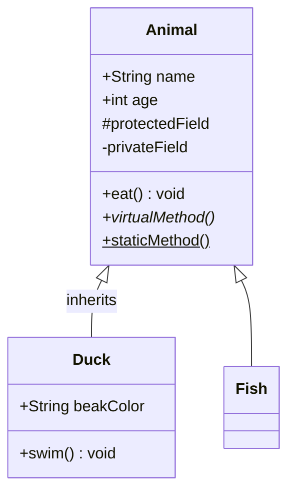
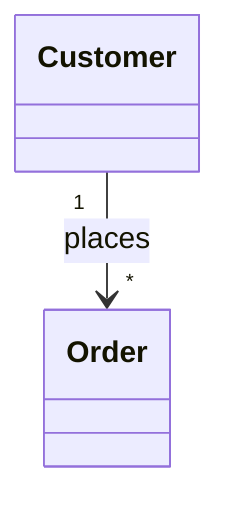
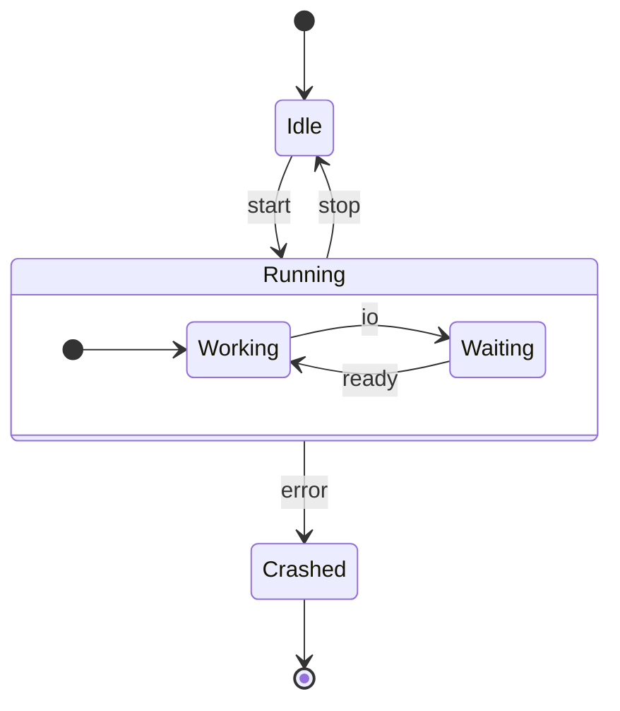
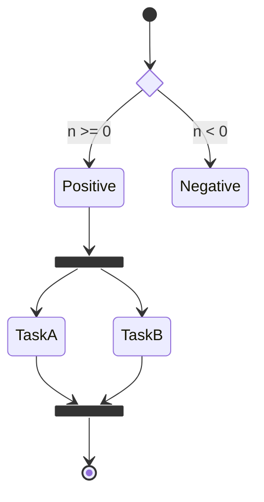
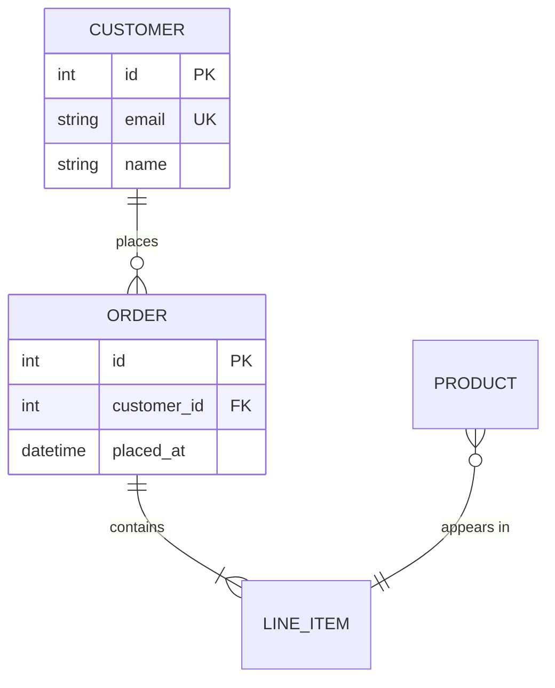
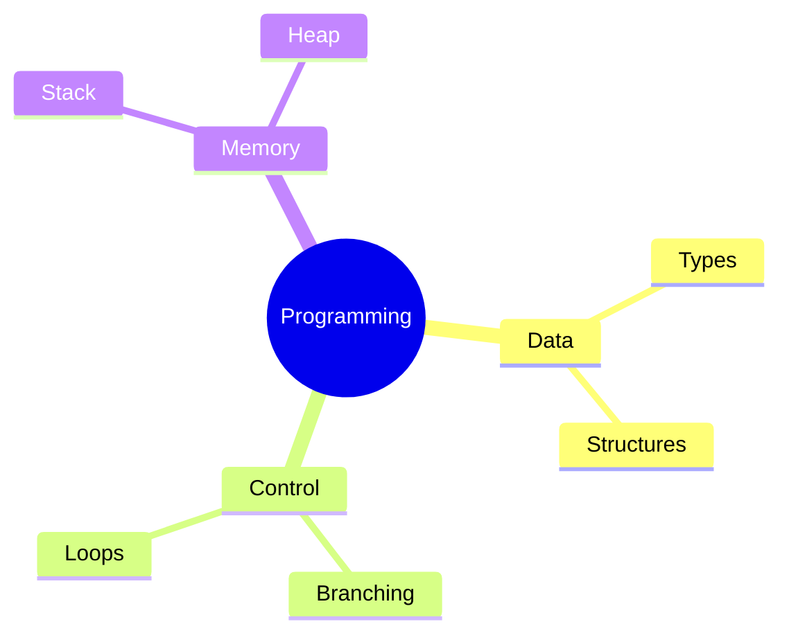
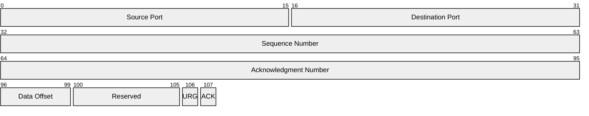
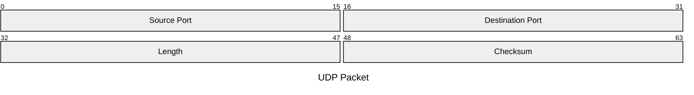
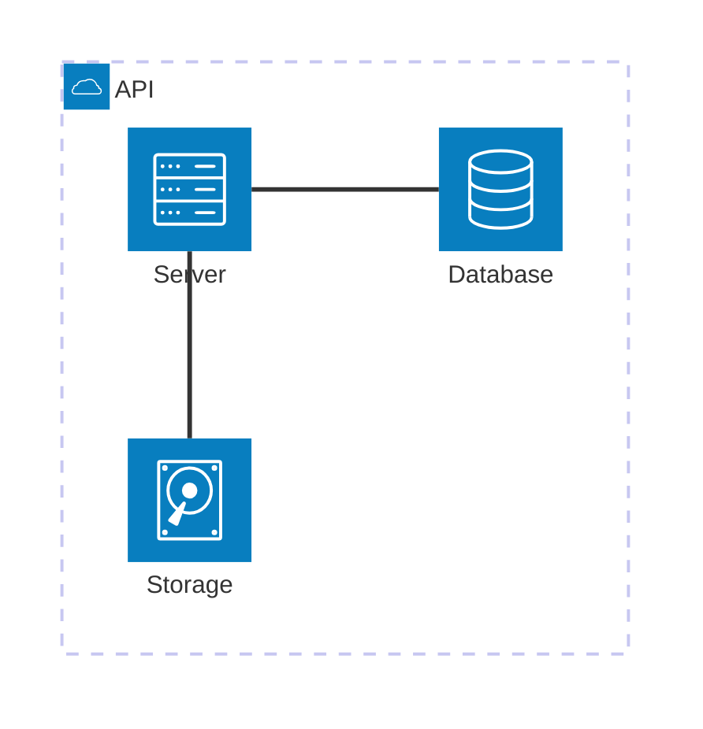

# Mermaid structure diagrams

Class, state, ER, mindmap, packet, and architecture — the diagrams that describe *shape*
rather than sequence.

## Class diagram

Visibility prefixes: `+` public, `-` private, `#` protected, `~` package.
Suffixes: `*` abstract, `$` static.

Relations, read left-to-right:

| Syntax | Meaning |
|---|---|
| `A <|-- B` | B inherits A |
| `A *-- B` | composition (B is part of A, dies with it) |
| `A o-- B` | aggregation (B belongs to A, outlives it) |
| `A --> B` | association |
| `A ..> B` | dependency |
| `A ..|> B` | realization / implements |
| `A -- B` | plain link |

Cardinality goes in quotes on either end:

Generics use `~`: `class Stack~T~ { +push(T) }`.
Styling: `class Animal:::highlight` plus a `classDef highlight fill:#fee`.

## State diagram

`[*]` is both the start and end pseudo-state, depending on which side of the arrow it's on.
Composite states nest with `state Name { … }`.

Choice, fork, and join:

Notes: `note right of State1 : text`, or a multi-line `note left of X` … `end note`.
Concurrency inside a composite state uses `--` as a region separator.

## Entity relationship diagram

Cardinality is read as *left-entity to right-entity*, with the marker nearest each entity
describing that side:

| Marker | Meaning |
|---|---|
| `|o` / `o|` | zero or one |
| `||` | exactly one |
| `}o` / `o{` | zero or more |
| `}|` / `|{` | one or more |

`--` is an identifying relationship (solid), `..` non-identifying (dashed).
Attribute keys: `PK`, `FK`, `UK`.

## Mindmap

Indentation alone defines the hierarchy — no arrows.

Node shapes on any level: `id[square]`, `id(rounded)`, `id((circle))`, `id))bang((`,
`id)cloud(`, `id{{hexagon}}`. Icons via `::icon(fa fa-book)` on the line below a node.

Mindmaps auto-size well and are the least fussy diagram for an agenda or overview slide.

## Packet diagram

Byte or bit layouts — headers, protocol frames, struct memory.

Ranges must be contiguous and ascending; a single number is a one-bit field. The `+N`
form sizes a field relative to the previous one, which is easier to maintain:

## Architecture diagram

Services, groups, and the links between them.

Edge endpoints carry a side: `L`, `R`, `T`, `B`, so `db:L -- R:server` leaves the left of
`db` and enters the right of `server`. Arrowheads with `<` / `>`: `db:L <-- R:server`.
Icons in parentheses come from registered icon packs (`cloud`, `database`, `disk`,
`server`, `internet` are built in).
